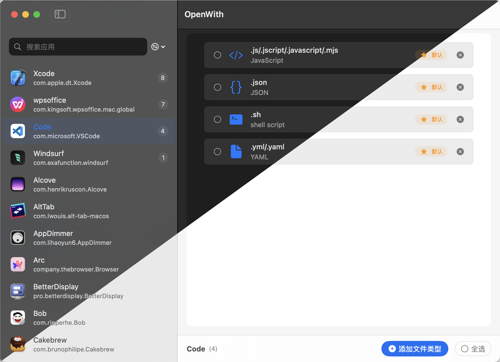

# OpenWith

[](https://github.com/XiCheng148/CodeRadio/releases)
[](https://swift.org)
[](https://www.apple.com/macos/)
[](LICENSE)
[](https://github.com/XiCheng148/OpenWith/actions)
[](https://github.com/XiCheng148/OpenWith/pulls)

一个用于管理 macOS 文件类型关联的工具，帮助用户快速查看和修改文件的默认打开方式。



## 功能特性

- 🔍 **应用程序管理**
  - 显示系统中所有已安装的应用程序
  - 支持按名称搜索和过滤
  - 显示应用程序图标、名称和 Bundle ID
  - 右侧数字显示关联的文件类型数量
  
- 📁 **文件关联管理**
  - 查看应用程序支持的文件类型
  - 添加/移除文件类型关联
  - 设置默认打开方式
  - 支持 .js、.json、.sh、.yml 等常见开发文件类型
  
- 🎨 **现代化界面**
  - 双栏式布局设计
  - 深色模式支持
  - 流畅的动画效果
  - 符合 macOS 设计规范
  - 简洁直观的操作方式

## Install

- Download prebuilt binary from [GitHub release page](https://github.com/XiCheng148/OpenWith/releases).
- enjoy~

## 开发环境要求

- macOS 14.0+
- Xcode 16.0+
- Swift 6.0
- [Tuist](https://tuist.io) 4.37.0+

## 快速开始

1. 安装 Tuist:
   ```bash
   tuist install
   ```
2. 克隆项目到本地：
   ```bash
   git clone https://github.com/yourusername/OpenWith.git
   ```
3. 进入项目目录：
   ```bash
   cd OpenWith
   ```
4. 生成 Xcode 项目：
   ```bash
   tuist generate
   ```
5. 打开 Xcode 项目并运行应用程序。


## 许可证
该项目遵循 MIT 许可证，详细信息请查看 LICENSE 文件。

## 感谢

- [Tuist](https://tuist.io) - 项目管理工具
- [Awesome-Merge-Picture](https://github.com/XiCheng148/Awesome-Merge-Picture) - A tool to quickly create a preview image of a dark 和 light mode project.

